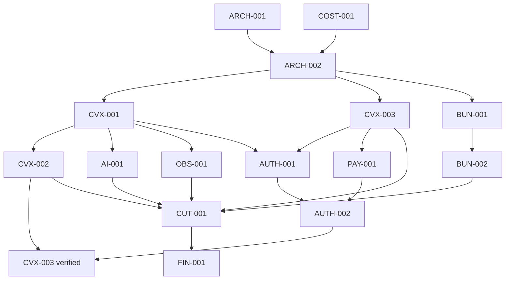

# Spresso Platform Cost Migration Implementation Plan

> **For agentic workers:** REQUIRED SUB-SKILL: Use superpowers:subagent-driven-development (recommended) or superpowers:executing-plans to implement this plan task-by-task. Steps use checkbox (`- [ ]`) syntax for tracking.

**Goal:** Replace Spresso's dormant and overlapping Google data/runtime design with one low-cost owner per concern while retaining Firebase Authentication and adding passkey step-up MFA.

**Architecture:** Firebase Auth remains identity. **Convex is the sole application database (owner decision, 2026-09-08):** reactive product state, AI threads, workflows, commerce action log, WebAuthn public credentials, challenges, one-time step-up grants, and RevenueCat entitlements all live in Convex documents guarded by serializable transactions. Spresso owns no inventory or fulfillment ledger, so no second relational database is justified. Bunny owns static and media bytes. Stripe remains the merchant-retail financial authority; RevenueCat owns Spresso digital-product entitlements; merchants remain the price, availability, and fulfillment authorities.

**Tech Stack:** Firebase Authentication, Convex, `@convex-dev/agent`, `@convex-dev/migrations`, WebAuthn, `@simplewebauthn/server`, Android Credential Manager, RevenueCat, Bunny Storage/CDN/Stream, Stripe, ChatGPT Apps SDK (`@modelcontextprotocol/sdk`, `@modelcontextprotocol/ext-apps`), TypeScript, Kotlin Multiplatform, convex-test/Vitest, Gradle/JDK 17.

**Spec:** `docs/superpowers/specs/2026-09-05-platform-cost-migration-design.md`

## Global Constraints

- Work in `/home/shaolin/Spresso`, not `/home/shaolin/sport`.
- Preserve Firebase Auth and Firebase UID as the canonical subject. Do not add Convex Auth. Convex is the sole application database; Neon and CockroachDB are rejected owners (2026-09-08 decision).
- Treat passkeys as Spresso application-level step-up MFA. Firebase native MFA currently supports phone/TOTP, not WebAuthn.
- Do not accept a Firebase token refresh, local biometric result, detached client signature, or client boolean as passkey proof.
- Clients never receive Bunny, Stripe, RevenueCat, WebAuthn, or provider secrets.
- Store money as integer minor units or exact numeric values, never binary floats.
- Use expand/backfill/contract migrations. No permanent dual writes.
- Before editing a symbol, run `node .gitnexus/run.cjs impact "<symbol>" --direction upstream --repo .`. Warn and stop for HIGH/CRITICAL risk; treat UNKNOWN as unresolved and confirm with text search.
- Before every commit, run `node .gitnexus/run.cjs detect-changes --scope all --repo .`. A partial/truncated result or zero with unseen files is not a clean result.
- Every behavior change follows red-green-refactor. Record the expected failing assertion before production code.
- Use JDK 17 for Gradle commands.
- No user-facing infrastructure jargon, mock success, hidden payment submission, client-supplied price authority, or agent-controlled financial action.
- Do not provision paid cloud resources, alter billing, create production databases/buckets, change DNS, deploy, or delete remote resources without separate owner approval.

---

## Why this is a plan suite

The approved design spans six independently reviewable systems. Implementing it as one giant patch would make rollback and review unsafe. Execute these plans in order:

1. [`2026-09-05-cost-guardrails-backend-contracts.md`](2026-09-05-cost-guardrails-backend-contracts.md)
2. [`2026-09-05-convex-live-state-ai-migration.md`](2026-09-05-convex-live-state-ai-migration.md)
3. [`2026-09-08-convex-commerce-passkey-revenuecat.md`](2026-09-08-convex-commerce-passkey-revenuecat.md)
4. [`2026-09-08-chatgpt-apps-sdk-surface.md`](2026-09-08-chatgpt-apps-sdk-surface.md)
5. [`2026-09-08-prompt-guardrails.md`](2026-09-08-prompt-guardrails.md)
6. [`2026-09-05-bunny-media-cutover-finops.md`](2026-09-05-bunny-media-cutover-finops.md)

Each child plan must finish with testable software. Do not use a later child plan to justify an unsafe intermediate state.

## Ticket queue

| Order | Ticket | Priority | Effort | Outcome | Blocked by |
| --- | --- | --- | --- | --- | --- |
| 1 | ARCH-001 Neutralize dormant Google fixed-cost infrastructure | P0 | S | Terraform cannot accidentally create Spanner/VPC/always-warm Run | — |
| 2 | COST-001 Stop Firestore client logging | P0 | S | Zero Firestore writes from client logs | — |
| 3 | ARCH-002 Introduce typed backend contracts | P0 | M | Provider-specific transport is behind domain gateways | ARCH-001 |
| 4 | CVX-001 Bootstrap Convex with Firebase Auth | P1 | M | Firebase-authenticated Convex foundation | ARCH-002 |
| 5 | CVX-002 Migrate reactive personal state | P1 | M | O(1) writes and live subscriptions | CVX-001 |
| 6 | AI-001 Move AI control to Convex Agent | P1 | M/L | Streaming threads, rate limits, usage, single-flight | CVX-001 |
| 7 | OBS-001 Remove Pub/Sub and batch interactions | P1 | S/M | No-op pipeline removed; up to ~95% fewer ingestion calls at batch size 20 | CVX-001 |
| 8 | CVX-003 Commerce action log and passkeys on Convex documents | P1 | L | Uniqueness via serializable get-then-insert; no second database | CVX-001 |
| 9 | PAY-001 Make checkout idempotent | P0 | M | One processor intent/order under concurrency | CVX-003 |
| 10 | RC-001 RevenueCat entitlements on Convex | P1 | M | Server-verified digital-product grants via signed webhook | CVX-001 |
| 11 | AUTH-001 Implement passkey enrollment/assertion | P1 | L | Server-verified multi-passkey support | CVX-001, CVX-003 |
| 12 | AUTH-002 Bind passkey grants to sensitive actions | P1 | M | Firebase token alone cannot authorize protected action | AUTH-001, PAY-001 |
| 13 | APP-001 ChatGPT Apps SDK read-only discovery surface | P2 | M | Validated, rate-limited MCP tools + widget over Convex | ARCH-002, CVX-001 |
| 14 | BUN-001 Move media bytes to Bunny | P2 | M | Content-addressed signed media delivery | ARCH-002 |
| 15 | BUN-002 Move static hosting after API split | P2 | S/M | Bunny hosts SPA; API origin remains explicit | BUN-001 |
| 16 | CUT-001 Decommission by domain | P2 | L | Old owners removed after reconciliation | CVX-002, AI-001, OBS-001, CVX-003, BUN-002 |
| 17 | FIN-001 Add cost gates | P3 | S | Unit-cost dashboard, alerts, and ceilings | production samples |

AUTH-001 and AUTH-002 are security/product prerequisites, not cost-saving claims. Bunny work remains P2 because no Firebase Storage bucket is currently deployed; execute it when media bytes exist.

## Prioritized recommendation register

Cost impact is deliberately expressed as avoided fixed cost or a measurable unit-cost target where production usage is currently zero. The implementation must replace estimates with provider usage exports before claiming realized savings.

| Ticket | Current inefficiency | Proposed optimization | Expected cost impact | Effort | Risks / tradeoffs | Exact change set |
| --- | --- | --- | --- | --- | --- | --- |
| ARCH-001 | Dormant Terraform can provision one-node Spanner, VPC/connector, storage, and always-warm Cloud Run. | Make ownership executable and remove fixed-cost declarations after remote-state proof. | Avoids about **$657/month** for the declared Spanner node, plus unmeasured Run/network/storage charges; current realized saving is $0 because these services are not deployed. | S | Accidental deletion if remote state is assumed empty. | `contracts/backend-ownership.json`, ownership verifier, `terraform/*.tf`, fixed-runtime test; Child Plan 1 Tasks 1–2. |
| COST-001 | Up to 84 web call sites can route operational logs into Firestore. | Preserve logger APIs but remove Firestore writes; use redacted console/error telemetry. | Eliminates per-log Firestore writes/index storage when traffic starts and removes a collection from operations; near-$0 current saving. | S | Reduced ad-hoc log querying unless the error sink is configured. | `src/lib/firebase.ts`, `src/lib/Logger.ts`, `functions/src/users.ts`, Firestore rules/indexes; Child Plan 1 Task 3. |
| ARCH-002 | Twenty-five client files depend on Firebase callable transport, making every migration broad and risky. | Add typed web/KMP domain gateways and Firebase token injection. | Indirect high impact: enables each later provider retirement and prevents permanent duplicate transports. | M | Temporary adapter complexity; careless bulk replacement has HIGH blast radius. | `src/services/backend/*`, KMP `network/*`, focused adapter tests; Child Plan 1 Task 4. |
| CVX-001/CVX-002 | Personal reactive state is designed across Functions/Firestore/Data Connect, including array-style rewrites. | Use Firebase-authenticated Convex functions, indexed item tables, granular mutations, and live subscriptions. | Removes duplicate API/function/database plumbing; target lower writes and operator time. Validate calls/read bytes/p95 during pilot before claiming dollars. | M/L | Convex coupling and regional latency; unbounded queries can erase savings. | `convex/auth.config.ts`, bounded schema/functions/migrations, `ConvexGateway`, per-domain cutover contract; Child Plan 2 Tasks 1–3. |
| AI-001 | AI state, caching, budgets, and workflow logic are split across custom Functions and persistent stores. | Consolidate threads/workflows/rate limits/usage and single-flight in Convex Agent while retaining provider fallbacks. | Prevents duplicate concurrent model/media calls—the dominant variable-cost risk—and removes custom queue/state plumbing. | M/L | Agent/runtime lock-in and action compute; context growth must be bounded. | `convex/agents.ts`, tools/workflows/cost limits, AI gateway adapters and tests; Child Plan 2 Task 4. |
| OBS-001 | Per-event interaction ingestion and a no-op Pub/Sub path add calls and operational surface. | Batch up to 20 events, dedupe server-side, remove the unused topic/trigger after proof. | Up to **95% fewer ingestion calls** at full batch size; avoids future Pub/Sub operations and ownership overhead. | S/M | Crash loss for unsent client batches; mitigate with bounded durable retry. | Convex interaction mutation, web/KMP buffers, Pub/Sub trigger/config retirement; Child Plan 2 Task 5. |
| CVX-003 | Catalog/commerce contracts overlap Data Connect, PGAdapter/Cloud SQL, imperative DDL, and Spanner code, and a Neon plan would add a second control plane Spresso does not need. | Model the commerce action log, passkey credentials, and entitlements as Convex documents; enforce natural unique keys via serializable get-then-insert with convex-test concurrency tests. | One database control plane instead of two; transactional uniqueness without a relational engine; analytics served by Convex exports rather than a parallel OLTP store. | L | Convention-based uniqueness must be test-proven; analytical SQL questions move to exports. | `convex/commerce/*`, `convex/passkeys.ts`, `convex/entitlements.ts`, removal of Data Connect/PGAdapter/Spanner after cutover; Child Plan 3. |
| PAY-001 | Checkout can place merchant/Stripe work inside retry-sensitive orchestration and lacks one durable idempotency owner. | Acquire via serializable get-then-insert mutation; run Stripe/merchant calls in Node actions outside transactions; webhook inbox documents with replay-safe delivery. | Prevents duplicate payment/provider calls, refunds, and support work; reliability saving outweighs small database cost. | M | More explicit state transitions and recovery paths. | `convex/commerce/checkout.ts`, webhook/payment adapters and concurrency tests; Child Plan 3. |
| AUTH-001/AUTH-002 | Existing passkey artifacts are incomplete; checkout currently treats Google reauth plus a client boolean as biometric proof. | Keep Firebase Auth and add server-verified WebAuthn enrollment/assertion with Convex one-time grant documents bound to sensitive actions. | Security investment, not a direct cost reduction; avoids switching identity providers solely for passkeys. | L | Recovery/lockout complexity, RP/origin configuration, authenticator compatibility. | `convex/passkeys.ts`, `@simplewebauthn/server` actions, browser/Android clients, checkout grant consumption, profile settings; Child Plan 3. |
| BUN-001 | Generated media writes to Firebase Storage code and onboarding uploads directly from the browser; no active bucket means no present bill. | Add a Convex Node-action `MediaStore`, migrate generated bytes server-to-server to Bunny, use content-addressed keys and signed CDN delivery. | No current saving; at media launch, shifts byte storage/egress to usage-priced delivery and improves cache offload. | M | Private-cache leakage, secret exposure, preview S3 limitations. | `convex/media/*`, `convex/ai/jobs.ts`, migration/reconciliation scripts and lifecycle runbook; Child Plan 4 Tasks 1–2. |
| BUN-002 | Firebase Hosting couples the SPA to a same-origin `/api/**` Function rewrite. | Split API origin, then publish hashed static assets to Bunny with SPA fallback and rollback. | Avoids retaining Hosting only as a router and reduces origin bandwidth once traffic exists. | S/M | Bad cache headers or DNS cutover can strand clients. | static-hosting contract/smoke scripts, Bunny header config, `firebase.json`, release workflow; Child Plan 4 Task 3. |
| CUT-001 | Legacy code/config can remain billable after data cutover and can silently become a second owner. | Retire callers first, reconcile final delta, observe, then remove each provider boundary with approval evidence. | Captures the savings of all earlier tickets; prevents paying for idle duplicate services. | L | Irreversible data loss if observation/restore gates are skipped. | provider-retirement contract/verifier, Firebase/package/workflow cleanup, remote teardown runbook; Child Plan 4 Task 4. |
| FIN-001 | No unit-cost baseline or automated provider ceiling exists. | Collect aggregate usage and calculate cost per active user/order/AI turn/media job; warn at 50/80/100% thresholds. | Prevents surprise bills and makes savings attributable; direct saving depends on traffic and enforced optional-work ceilings. | S | Bad price inputs or early thresholds can reject useful optional work. | `contracts/cost-budgets.json`, `scripts/finops/*`, tests, runbook, CI report job; Child Plan 4 Task 5. |

## Dependency flow

## Delivery gates

| Wave | Exit gate | Rollback |
| --- | --- | --- |
| 0 — guardrails | Ownership check passes; zero Firestore log writes; typed gateway contract test passes | Legacy adapters remain selectable |
| 1 — Convex | Source/target count and hash reconciliation; invalid target rows zero; p95 no worse than baseline; AI budget and single-flight tests pass | Switch reads back before final legacy-write freeze |
| 2 — Commerce + passkeys | WebAuthn negative/replay suite passes; one intent/order under concurrency; webhook replay produces one order | Keep enrollment optional; disable enforcement policy |
| 3 — Bunny + retirement | Signed media, lifecycle deletion, cache, CORS, and deep-link smoke tests pass; no old runtime references | Change custom-domain origin back during observation window |
| 4 — FinOps | Real production samples populate unit-cost dashboard and alerts | Alerts-only mode |

## Required evidence per ticket

Every ticket handoff contains:

- GitNexus pre-edit impact result and risk.
- The failing test output observed before production code.
- The focused passing test output.
- Package-level regression gate output.
- `git diff --check`.
- GitNexus `detect-changes --scope all` result.
- Migration counts, invalid counts, and checksums where data moved.
- Deployment or external-resource commands listed but not executed without owner approval.

## Execution stop conditions

Stop and ask the owner before:

- enabling billing or upgrading Firebase Authentication with Identity Platform;
- creating/deleting Convex, Bunny, RevenueCat, or production resources;
- creating Bunny zones/libraries, changing DNS, or purging production content;
- deploying Convex/Firebase/containers;
- rotating secrets or changing Firebase Auth providers;
- making passkeys mandatory for all sign-ins;
- deleting a remote legacy service or shortening its recovery window.
