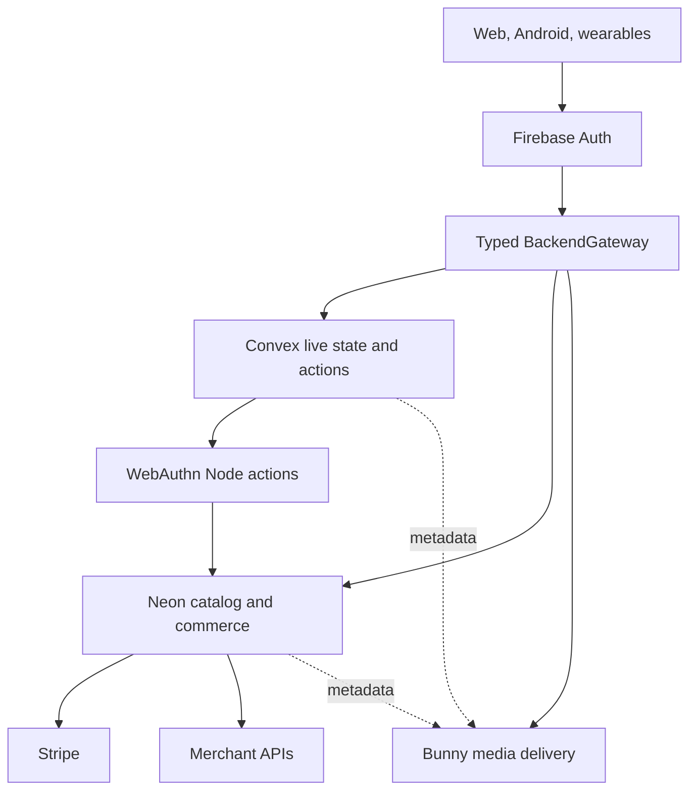

# Spresso Platform Cost Migration Design

**Status:** Approved for implementation planning on 2026-09-05

## Goal

Reduce future infrastructure, API, compute, storage, and operational cost without reducing reliability or user-facing performance. Preserve Firebase Authentication, use Convex only for reactive application state and AI orchestration, use Neon PostgreSQL only for relational catalog and commerce state, and use Bunny only for static/media delivery.

The migration must remove obsolete Google runtime owners. It must not recreate Firestore, Data Connect, Cloud SQL, Spanner, Pub/Sub, Functions, Storage, Convex, Neon, and Bunny as a permanent dual-write mesh.

## Verified starting point

- The live Firebase project is `get-spresso`.
- The default Firestore database exists as Standard/Native, but it has no top-level collections and Cloud Monitoring returned no read, write, or delete series for the preceding 30 days.
- Project documentation says Functions, Cloud Run, and Storage are disabled or not deployed.
- The repository exports 48 callable Functions, 3 HTTP Functions, and 1 Pub/Sub function in source.
- Twenty-five client files depend on Firebase callable transport.
- Eighty-four web call sites can route logs to Firestore.
- `terraform/main.tf` can create a one-node regional Spanner instance, VPC/peering/connector, secrets, a bucket, and an always-warm Cloud Run service. The Spanner node alone would cost about $657 per 730-hour month at the documented $0.90/node-hour rate.
- GitNexus matched repository HEAD `fcd5de2`. `callFirebaseFunction` has HIGH upstream blast radius: five direct callers and three indexed execution flows. Provider cutover must be incremental.

The present Google runtime spend is therefore approximately zero. The first migration value is avoiding dormant fixed-cost resources and duplicated control planes, not claiming a bill reduction that has not occurred.

## Ownership decision

| Concern | Authoritative owner | Explicit non-owners |
| --- | --- | --- |
| Google, email, and anonymous identity | Firebase Authentication | Convex Auth, Neon Auth, application databases |
| Passkey credentials, challenges, and step-up grants | Neon, accessed through authenticated Convex Node actions | Firebase native MFA, clients, Bunny, Convex tables |
| Profiles, preferences, onboarding, carts, saved products, wardrobe, groceries, trips, and live job state | Convex | Neon unless relational evidence later requires it |
| AI threads, messages, tools, usage, budgets, rate limits, and workflow status | Convex Agent and components | Firestore, Pub/Sub |
| Product/listing normalization, price lineage, checkout attempts, processor references, webhook inbox, orders, returns, and subscriptions | Neon PostgreSQL | Convex as ledger, client-direct SQL |
| Card-payment authority | Stripe | Neon and Convex |
| Merchant price, availability, and fulfillment truth | Merchant/provider response | cached discovery records |
| Images, generated assets, short finished MP4/WebM, and static web assets | Bunny Storage + CDN | Convex, Neon, Firebase Storage |
| Long/adaptive video | Bunny Stream only when transcoding, managed playback, or protection is needed | database blobs, Bunny Stream for every short clip |
| Operational errors and product analytics | console + Crashlytics/Analytics initially | Firestore operational collections |

Firebase UID is the cross-platform subject. Clients obtain a Firebase ID token and present it to the target gateway. Authorization remains server-side and every user-scoped query is constrained by the verified UID.

## Target topology

No client receives a Neon connection string, Bunny storage credential, Stripe secret, WebAuthn private key, or provider secret.

## Passkey MFA decision

Firebase Authentication remains the first factor. Current Firebase Authentication with Identity Platform documentation supports phone and TOTP second factors, not WebAuthn passkeys. Spresso will therefore implement **application-level passkey step-up MFA** for sensitive operations. It must not be described as Firebase-native MFA.

### Enrollment

1. A non-anonymous user completes recent Firebase reauthentication.
2. The client calls an authenticated Convex Node action for registration options.
3. The action creates an opaque WebAuthn user handle and a random five-minute challenge in Neon.
4. The browser WebAuthn API or Android Credential Manager creates the credential.
5. The client sends the complete registration response to the action.
6. `@simplewebauthn/server` verifies the challenge, RP ID, exact allowed origin, user-verification flag, and attestation response.
7. Neon atomically consumes the challenge and stores the public credential record. A user may register more than one passkey.

Private keys and biometric data remain in the authenticator. The server stores only public credential material and ceremony metadata.

### Sensitive-action step-up

1. The server creates or refreshes the authoritative resource first. For checkout, it obtains a fresh merchant quote and creates an `AWAITING_STEP_UP` attempt.
2. The client requests assertion options bound to Firebase UID, purpose, resource ID, server-calculated amount, and currency.
3. The authenticator signs the server challenge with user verification required.
4. The action verifies the assertion and atomically consumes the challenge.
5. Neon creates a random opaque `step_up_authorization` that expires after five minutes and is single-use.
6. Checkout, wallet transfer, passkey enrollment, and passkey revocation consume the matching authorization in the same transaction that advances the protected operation.

A Firebase ID-token refresh, local biometric result, detached client signature, or client boolean is never accepted as passkey proof.

### Recovery and rollout

- Enrollment remains optional during onboarding.
- Roll out to staff, then opt-in users, then require step-up only for checkout, wallet transfer, and passkey management.
- Users can name, add, and revoke multiple passkeys.
- Enrollment and revocation require recent Firebase reauthentication and an out-of-band notification.
- Removing the final passkey requires the documented recovery ceremony. Anonymous, email-link-only, and support-agent bypasses are forbidden.
- Passkey-at-login is out of scope. If it becomes mandatory, Spresso must evaluate a custom auth gateway or a passkey-capable identity provider as a separate migration.

## Relational model

Neon owns these passkey tables in addition to the catalog and commerce tables:

- `passkey_accounts(firebase_uid primary key, user_handle unique, created_at)`
- `passkey_credentials(credential_id primary key, firebase_uid, public_key, sign_count, transports, device_type, backed_up, created_at, last_used_at, revoked_at)`
- `webauthn_challenges(id primary key, firebase_uid, ceremony, challenge unique, purpose, resource_id, amount_minor, currency, expires_at, consumed_at)`
- `step_up_authorizations(id primary key, firebase_uid, credential_id, purpose, resource_id, amount_minor, currency, expires_at, consumed_at)`

Money is stored as integer minor units or exact numeric values, never GraphQL `Float`.

## Cache policy

| Data | Policy |
| --- | --- |
| Hashed JS/CSS and completed public media | Bunny immutable cache; one-year TTL for hashed assets |
| `index.html` | Bunny short TTL; publish last |
| Public catalog snapshots | Optional Bunny cache, 1–5 minute TTL, ETag, stale-while-revalidate after telemetry proves value |
| Private profiles, carts, wardrobe, and job/order projections | Convex indexed reactive queries; never public CDN cache |
| AI search/research result | Canonical input hash, TTL, and single-flight state in Convex; Bunny URL for large output |
| Personalized AI token stream | No response cache; persist bounded thread context |
| WebAuthn challenges and step-up grants | No cache; one-time five-minute Neon records |
| Merchant quote and payment result | No authoritative cache; persist immutable observed snapshots and idempotency keys |

Do not deploy Redis initially. Add a separate application cache only after query telemetry identifies repeated expensive reads that provider-native caching cannot address.

## Realtime and latency policy

- Likes, saved products, carts, wardrobe, and preferences use optimistic UI plus Convex mutation/subscription convergence.
- AI text chat uses Convex Agent streaming. Model time-to-first-token and tool latency dominate; Bunny does not help.
- Live audio uses a dedicated WebSocket relay. Convex stores session state, not PCM frames.
- Media generation acknowledges the job quickly, publishes progress through Convex, and sends completed bytes to Bunny.
- Passkey options and verification target sub-500 ms regional server time after the device prompt.
- Checkout prioritizes correctness and idempotency over edge placement. The merchant and Stripe calls dominate.
- Order status is committed to Neon, then projected idempotently to Convex for reactive display.

## Migration rules

1. Introduce typed provider-neutral domain contracts before changing transport.
2. Migrate by domain, not by provider.
3. For each domain: create optional target schema, import a snapshot, validate counts/hashes/invalid rows, switch reads, freeze legacy writes, import the final delta, switch writes, observe, then delete legacy.
4. Never maintain permanent dual writes.
5. Convex schema changes use expand/backfill/contract with `@convex-dev/migrations`, bounded batches, resumable cursors, and explicit completion metrics.
6. Neon changes use versioned Drizzle migrations on an isolated branch, pooled runtime connections, direct migration/recovery connections, count/checksum reconciliation, and a tested PITR/`pg_dump` restore.
7. Bunny uses a custom media domain and content-addressed keys so metadata does not embed provider-specific storage URLs.
8. Every cutover has a feature flag, observation window, and explicit rollback.

## High-impact work order

1. Remove dormant fixed-cost Google provisioning and Firestore client logging.
2. Add typed backend contracts and Firebase-token injection.
3. Bootstrap Convex, migrate high-write reactive state, and cap AI cost.
4. Bootstrap Neon commerce/catalog, correct checkout idempotency, then implement passkey step-up.
5. Move media and static delivery to Bunny only when real bytes exist.
6. Retire legacy providers by domain and add cost gates.

## Risks and mitigations

- **HIGH caller blast radius:** migrate `callFirebaseFunction` behind adapters one domain at a time; preserve a read-only rollback adapter until reconciliation completes.
- **Authorization regression:** derive UID from verified Firebase identity, never request fields. Add cross-user negative tests for every target domain.
- **Passkey replay or account lockout:** one-time transactions, exact origin/RP validation, multiple credentials, recent reauthentication, and audited recovery.
- **Neon cold resume:** measure p95. Keep checkout compute warm or lengthen suspension only if the measured first-query penalty violates the SLO.
- **Convex lock-in/cost:** keep domain interfaces provider-neutral, use bounded indexed queries, track calls/read bytes/action compute/egress, and maintain exports.
- **Bunny privacy/cache leak:** private media requires signed delivery; public cache keys must exclude identity and authorization data.
- **Dual-system drift:** snapshot plus final delta only; no open-ended bidirectional synchronization.

## Success criteria

- No dormant Terraform can create fixed-cost Spanner/VPC/always-warm Cloud Run without an approved cost record.
- Client logging creates zero Firestore writes.
- UI and shared KMP code contain no provider-specific transport calls.
- Each live-state domain has one Convex owner and bounded indexes.
- AI duplicate concurrent misses produce one provider call; per-user and global cost ceilings are enforced.
- Neon rehearsal proves schema migration, count/checksum reconciliation, one checkout result under concurrency, and restore.
- A Firebase token alone cannot authorize a passkey-protected action.
- Wrong user, origin, RP ID, purpose, resource, amount, currency, expired challenge, revoked credential, and replayed grant are rejected.
- Bunny media access, lifecycle deletion, cache headers, SPA deep links, and rollback pass smoke tests.
- Repository search finds no active Firestore data writes, Data Connect runtime, Cloud SQL/PGAdapter, Spanner, Firebase Storage, Pub/Sub, or retired Functions transport after final cutover.

## Implementation-plan decomposition

The approved design is implemented by four independently reviewable plans:

1. Cost guardrails and backend contracts.
2. Convex live state, AI, and telemetry migration.
3. Neon commerce plus passkey step-up MFA.
4. Bunny media/hosting, domain cutover, and FinOps.

Each plan must leave deployable, testable software and must not rely on later plans to make an unsafe intermediate state acceptable.

## Primary references

- [Firebase Authentication](https://firebase.google.com/docs/auth)
- [Firebase SMS MFA](https://firebase.google.com/docs/auth/web/multi-factor)
- [Firebase TOTP MFA](https://firebase.google.com/docs/auth/web/totp-mfa)
- [Google server-side passkey registration](https://developers.google.com/identity/passkeys/developer-guides/server-registration)
- [Google server-side passkey authentication](https://developers.google.com/identity/passkeys/developer-guides/server-authentication)
- [WebAuthn Level 3](https://www.w3.org/TR/webauthn-3/)
- [Convex custom JWT](https://docs.convex.dev/auth/advanced/custom-jwt)
- [Convex Agent](https://docs.convex.dev/agents/overview)
- [Neon connection pooling](https://neon.com/docs/connect/connection-pooling)
- [Neon branching workflow](https://neon.com/docs/get-started-with-neon/workflow-primer)
- [Bunny Storage pricing](https://bunny.net/pricing/storage/)
- [Bunny Stream best practices](https://docs.bunny.net/docs/stream-best-practices)
