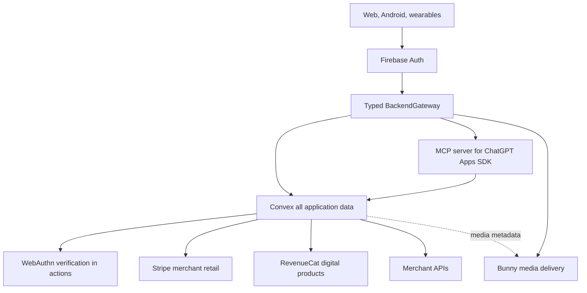

# Spresso Platform Cost Migration Design

**Status:** Approved for implementation planning on 2026-09-05. **Revised 2026-09-08: Convex-only data platform decision (owner-approved) — Neon PostgreSQL and CockroachDB are removed; Convex is the sole application database. ChatGPT Apps SDK surface and RevenueCat digital-product entitlements added.**

## Goal

Reduce future infrastructure, API, compute, storage, and operational cost without reducing reliability or user-facing performance. Preserve Firebase Authentication. Use **Convex as the only application database** — reactive state, AI orchestration, commerce action log, passkey credentials, and entitlements. Use Bunny only for static/media delivery. Keep Stripe as the merchant-retail payment authority; adopt RevenueCat for Spresso-owned digital products.

The 2026-09-08 decision rationale: Spresso is a product-discovery aggregator. It manages no physical inventory, no warehouse, and no multi-seller fulfillment ledger. Its backend is an action log, a preferences store, and a live agent-feedback channel — workload that fits Convex's transactional document model, WebSocket reactivity, Actions/Scheduler, and vector search directly. Relational schemas, foreign-key constraints, and a second database control plane would add friction without a corresponding requirement. Analytics needs are served by Convex exports, not by a parallel OLTP database.

The migration must remove obsolete Google runtime owners. It must not recreate Firestore, Data Connect, Cloud SQL, Spanner, Pub/Sub, Functions, Storage, Convex, or Bunny as a permanent dual-write mesh.

## Verified starting point

- The live Firebase project is `get-spresso`.
- The default Firestore database exists as Standard/Native, but it has no top-level collections and Cloud Monitoring returned no read, write, or delete series for the preceding 30 days.
- Project documentation says Functions, Cloud Run, and Storage are disabled or not deployed.
- The repository exports 48 callable Functions, 3 HTTP Functions, and 1 Pub/Sub function in source.
- Twenty-five client files depend on Firebase callable transport.
- Eighty-four web call sites can route logs to Firestore.
- `terraform/main.tf` can create a one-node regional Spanner instance, VPC/peering/connector, secrets, a bucket, and an always-warm Cloud Run service. The Spanner node alone would cost about $657 per 730-hour month at the documented $0.90/node-hour rate.
- GitNexus matched repository HEAD `fcd5de2`. `callFirebaseFunction` has HIGH upstream blast radius: five direct callers and three indexed execution flows. Provider cutover must be incremental.
- CVX-001 is implemented (commit `185e4ab`): Firebase custom-JWT `auth.config.ts` verified against the live `securetoken` OIDC discovery endpoint, `requireFirebaseIdentity` boundary with issuer pinning, indexed `users` table, 6/6 convex-test identity tests.

The present Google runtime spend is therefore approximately zero. The first migration value is avoiding dormant fixed-cost resources and duplicated control planes, not claiming a bill reduction that has not occurred.

## Ownership decision

| Concern | Authoritative owner | Explicit non-owners |
| --- | --- | --- |
| Google, email, and anonymous identity | Firebase Authentication | Convex Auth, application databases |
| Passkey credentials, challenges, and step-up grants | Convex documents, consumed inside the mutation that advances the protected action | Firebase native MFA, clients, Bunny |
| Profiles, preferences, onboarding, carts, saved products, wardrobe, groceries, trips, and live job state | Convex | any second database |
| AI threads, messages, tools, usage, budgets, rate limits, and workflow status | Convex Agent and components | Firestore, Pub/Sub |
| Checkout attempts, processor references, webhook inbox, order receipts, entitlements, catalog snapshots | Convex (action log; uniqueness via serializable transactions) | client-direct database access, a second SQL owner |
| Merchant-retail payment authority (physical goods) | Stripe | RevenueCat, store IAP (physical goods are not IAP-eligible under Google Play and App Store policy) |
| Spresso-owned digital products (Plus subscription, AI quota packs) | RevenueCat (cross-platform entitlements; web billing via its Stripe integration) | store IAP for ineligible goods, ad-hoc entitlement tables outside Convex |
| Merchant price, availability, and fulfillment truth | Merchant/provider response | cached discovery records |
| Images, generated assets, short finished MP4/WebM, and static web assets | Bunny Storage + CDN | Convex file storage for primary delivery, Firebase Storage |
| Long/adaptive video | Bunny Stream only when transcoding, managed playback, or protection is needed | database blobs, Bunny Stream for every short clip |
| Operational errors and product analytics | console + Crashlytics/Analytics initially | Firestore operational collections |

Firebase UID is the cross-platform subject. Clients obtain a Firebase ID token and present it to the target gateway. Authorization remains server-side and every user-scoped query is constrained by the verified identity (`tokenIdentifier` is the canonical Convex identity key; `subject` is the Firebase UID).

## Target topology

No client receives a Convex deployment secret, Bunny storage credential, Stripe secret, RevenueCat webhook secret, WebAuthn private key, or provider secret. The MCP server is a client of Convex through an internal service boundary; it never queries the database directly and exposes read-only discovery tools first.

## Passkey MFA decision

Firebase Authentication remains the first factor. Current Firebase Authentication with Identity Platform documentation supports phone and TOTP second factors, not WebAuthn passkeys. Spresso will therefore implement **application-level passkey step-up MFA** for sensitive operations. It must not be described as Firebase-native MFA.

### Enrollment

1. A non-anonymous user completes recent Firebase reauthentication.
2. The client calls an authenticated Convex action for registration options.
3. The action creates an opaque WebAuthn user handle and a random five-minute challenge document in Convex.
4. The browser WebAuthn API or Android Credential Manager creates the credential.
5. The client sends the complete registration response to the action.
6. `@simplewebauthn/server` verifies the challenge, RP ID, exact allowed origin, user-verification flag, and attestation response.
7. The verification mutation atomically consumes the challenge and stores the public credential document. A user may register more than one passkey.

Private keys and biometric data remain in the authenticator. The server stores only public credential material and ceremony metadata.

### Sensitive-action step-up

1. The server creates or refreshes the authoritative resource first. For checkout, it obtains a fresh merchant quote and creates an `AWAITING_STEP_UP` attempt.
2. The client requests assertion options bound to Firebase UID, purpose, resource ID, server-calculated amount, and currency.
3. The authenticator signs the server challenge with user verification required.
4. The action verifies the assertion and atomically consumes the challenge.
5. A random opaque `stepUpGrant` document is created in Convex; it expires after five minutes and is single-use.
6. Checkout, wallet transfer, passkey enrollment, and passkey revocation consume the matching grant in the same mutation that advances the protected operation.

A Firebase ID-token refresh, local biometric result, detached client signature, or client boolean is never accepted as passkey proof.

### Recovery and rollout

- Enrollment remains optional during onboarding.
- Roll out to staff, then opt-in users, then require step-up only for checkout, wallet transfer, and passkey management.
- Users can name, add, and revoke multiple passkeys.
- Enrollment and revocation require recent Firebase reauthentication and an out-of-band notification.
- Removing the final passkey requires the documented recovery ceremony. Anonymous, email-link-only, and support-agent bypasses are forbidden.
- Passkey-at-login is out of scope. If it becomes mandatory, Spresso must evaluate a passkey-capable identity provider as a separate migration.

## Document model (Convex-only)

Convex owns these collections in addition to the reactive state and AI tables:

- `users` — provisioned in CVX-001; `firebaseUid` and `tokenIdentifier` indexes.
- `checkoutAttempts` — one document per `(firebaseUid, idempotencyKey)`; uniqueness enforced by serializable get-then-insert inside a single mutation; CAS state machine `NEW → QUOTING → AWAITING_STEP_UP → READY_FOR_PAYMENT → PROCESSING → COMPLETED|FAILED`.
- `paymentAttempts` and `webhookInbox` — inbox documents unique per `(provider, eventId)`; duplicate delivery is detected inside the webhook mutation and acknowledged without repeating effects.
- `orders` and `orderItems` — customer-facing receipts written only by the verified webhook path.
- `passkeyAccounts`, `passkeyCredentials`, `webauthnChallenges`, `stepUpGrants` — documents with `expiresAt`/`consumedAt` semantics; grants and challenges are random, five-minute, purpose-bound, and single-use.
- `entitlements` — one document per user, the single source of truth for RevenueCat-granted digital products; written only by the signature-verified RevenueCat webhook path.

Money is stored as integer minor units, never floats. Composite uniqueness that Convex cannot express as a plain index is enforced by serializable get-then-insert inside one mutation, with a deduplication test under concurrency for each such key.

## Cache policy

| Data | Policy |
| --- | --- |
| Hashed JS/CSS and completed public media | Bunny immutable cache; one-year TTL for hashed assets |
| `index.html` | Bunny short TTL; publish last |
| Public catalog snapshots | Optional Bunny cache, 1–5 minute TTL, ETag, stale-while-revalidate after telemetry proves value |
| Private profiles, carts, wardrobe, and job/order state | Convex indexed reactive queries; never public CDN cache |
| AI search/research result | Canonical input hash, TTL, and single-flight state in Convex; Bunny URL for large output |
| Personalized AI token stream | No response cache; persist bounded thread context |
| WebAuthn challenges and step-up grants | No cache; one-time five-minute Convex documents |
| Merchant quote and payment result | No authoritative cache; persist immutable observed snapshots and idempotency keys |

Do not deploy Redis. Add a separate application cache only after query telemetry identifies repeated expensive reads that provider-native caching cannot address.

## Realtime and latency policy

- Likes, saved products, carts, wardrobe, and preferences use optimistic UI plus Convex mutation/subscription convergence.
- AI text chat uses Convex Agent streaming. Model time-to-first-token and tool latency dominate; Bunny does not help.
- Live audio uses a dedicated WebSocket relay. Convex stores session state, not PCM frames.
- Media generation acknowledges the job quickly, publishes progress through Convex, and sends completed bytes to Bunny.
- Passkey options and verification target sub-500 ms regional server time after the device prompt.
- Checkout prioritizes correctness and idempotency over edge placement. The merchant and Stripe calls dominate.
- Order status is committed to Convex directly; no cross-store projection is required in the Convex-only design.

## Migration rules

1. Introduce typed provider-neutral domain contracts before changing transport.
2. Migrate by domain, not by provider.
3. For each domain: create optional target schema, import a snapshot, validate counts/hashes/invalid rows, switch reads, freeze legacy writes, import the final delta, switch writes, observe, then delete legacy.
4. Never maintain permanent dual writes.
5. Convex schema changes use expand/backfill/contract with `@convex-dev/migrations`, bounded batches, resumable cursors, and explicit completion metrics. Never add a required field to a populated table: add `v.optional(...)`, backfill, then tighten.
6. Bunny uses a custom media domain and content-addressed keys so metadata does not embed provider-specific storage URLs.
7. Every cutover has a feature flag, observation window, and explicit rollback.
8. Analytical questions are answered from Convex exports or the dashboard, never by adding a second transactional database.

## High-impact work order

1. Remove dormant fixed-cost Google provisioning and Firestore client logging.
2. Add typed backend contracts and Firebase-token injection.
3. Bootstrap Convex (done, CVX-001), migrate high-write reactive state, and cap AI cost.
4. Move commerce checkout idempotency, passkey step-up, and RevenueCat entitlements onto Convex documents.
5. Stand up the ChatGPT Apps SDK read-only discovery surface (MCP server + widget) on Convex public catalog queries.
6. Move media and static delivery to Bunny only when real bytes exist.
7. Retire legacy providers by domain and add cost gates.

## Risks and mitigations

- **HIGH caller blast radius:** migrate `callFirebaseFunction` behind adapters one domain at a time; preserve a read-only rollback adapter until reconciliation completes.
- **Authorization regression:** derive UID from verified Firebase identity, never request fields. Add cross-user negative tests for every target domain.
- **Passkey replay or account lockout:** one-time mutations, exact origin/RP validation, multiple credentials, recent reauthentication, and audited recovery.
- **Uniqueness races in the document model:** every natural unique key (idempotency, webhook event ID) gets a serializable get-then-insert implementation plus a convex-test concurrency test; a failure is a defect, not a known limitation.
- **Convex lock-in/cost:** keep domain interfaces provider-neutral, use bounded indexed queries, track calls/read bytes/action compute/egress, and maintain exports. Analytics needs that outgrow exports are escalated as a separate decision, not absorbed into OLTP.
- **Document-size discipline:** no unbounded arrays; child tables with foreign-key-style `Id` references per Convex guidelines; high-churn fields split from stable profiles.
- **Bunny privacy/cache leak:** private media requires signed delivery; public cache keys must exclude identity and authorization data.
- **Dual-system drift:** snapshot plus final delta only; no open-ended bidirectional synchronization.

## Success criteria

- No dormant Terraform can create fixed-cost Spanner/VPC/always-warm Cloud Run without an approved cost record.
- Client logging creates zero Firestore writes.
- UI and shared KMP code contain no provider-specific transport calls.
- Each live-state domain has one Convex owner and bounded indexes.
- AI duplicate concurrent misses produce one provider call; per-user and global cost ceilings are enforced.
- Twenty concurrent identical checkout requests produce exactly one attempt, one merchant quote, and one processor intent; a replayed webhook event produces exactly one order.
- A Firebase token alone cannot authorize a passkey-protected action.
- Wrong user, origin, RP ID, purpose, resource, amount, currency, expired challenge, revoked credential, and replayed grant are rejected.
- RevenueCat-granted entitlements change only through the signature-verified webhook path.
- The MCP server exposes only validated, rate-limited, read-only discovery tools; its responses are schema-validated structured content.
- Bunny media access, lifecycle deletion, cache headers, SPA deep links, and rollback pass smoke tests.
- Repository search finds no active Firestore data writes, Data Connect runtime, Cloud SQL/PGAdapter, Spanner, Firebase Storage, Pub/Sub, or retired Functions transport after final cutover.

## Implementation-plan decomposition

The approved design is implemented by independently reviewable plans:

1. Cost guardrails and backend contracts.
2. Convex live state, AI, and telemetry migration.
3. Convex commerce, passkey step-up MFA, and RevenueCat entitlements.
4. ChatGPT Apps SDK discovery surface and prompt guardrails.
5. Bunny media/hosting, domain cutover, and FinOps.

Each plan must leave deployable, testable software and must not rely on later plans to make an unsafe intermediate state acceptable.

## Primary references

- [Firebase Authentication](https://firebase.google.com/docs/auth)
- [Firebase SMS MFA](https://firebase.google.com/docs/auth/web/multi-factor)
- [Firebase TOTP MFA](https://firebase.google.com/docs/auth/web/totp-mfa)
- [Google server-side passkey registration](https://developers.google.com/identity/passkeys/developer-guides/server-registration)
- [Google server-side passkey authentication](https://developers.google.com/identity/passkeys/developer-guides/server-authentication)
- [WebAuthn Level 3](https://www.w3.org/TR/webauthn-3/)
- [Convex custom JWT](https://docs.convex.dev/auth/advanced/custom-jwt)
- [Convex Agent](https://docs.convex.dev/agents/overview)
- [Convex AI guidelines (installed)](convex/_generated/ai/guidelines.md)
- [ChatGPT Apps SDK quickstart](https://developers.openai.com/plugins/build/app-quickstart)
- [RevenueCat webhooks](https://www.revenuecat.com/docs/integrations/webhooks)
- [Bunny Storage pricing](https://bunny.net/pricing/storage/)
- [Bunny Stream best practices](https://docs.bunny.net/docs/stream-best-practices)
