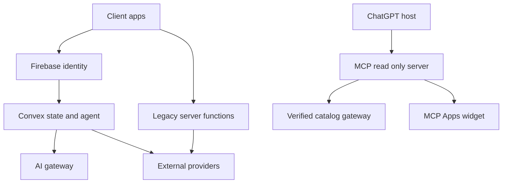

## Executive summary

Spresso is a native-first product discovery and conversational commerce system with a React companion, Firebase identity and legacy Functions, Convex user-state and AI foundations, and a newly implemented stateless ChatGPT Apps SDK boundary. The highest risks are cross-user authorization errors around sensitive Convex threads and future MCP OAuth, exfiltration of encrypted body/location/chat data, prompt injection crossing merchant data into agent instructions, and accidental activation of financial or wallet actions. Current controls include server-derived Firebase identity, Convex ownership tests, strict Zod schemas, component rate limiting, server-owned agent instructions, read-only MCP tools, and fail-closed catalog configuration. The migration is incomplete: the MCP catalog gateway is not configured, Convex user state is not yet the sole runtime owner, and production cloud endpoints were not deployed by this work.

## Scope and assumptions

- **In scope:** `convex/`, `mcp-server/`, the root web client paths that call AI or Firebase (`src/lib/firebase.ts`, `src/lib/chatStream.ts`, `src/components/features/chat/PersonalAIShopperChatPage.tsx`, `src/components/LiveCookingAssistantModal.tsx`), relevant AI/Function boundaries under `functions/src/ai/`, and package/deployment configuration.
- **Data sensitivity:** raw body scans/3D/4D meshes and precise measurements are assumed to be persisted encrypted with explicit consent and retention/deletion workflows. Precise location is assumed to be persisted for personalization. Chat threads and prompts are assumed to have indefinite account-history retention until user deletion is implemented and verified.
- **MCP identity:** the initial intended MCP release is OAuth-authenticated discovery. The implemented surface is currently read-only and has no OAuth routes; it must not be connected to user data until OAuth and account mapping are implemented and verified.
- **Deployment:** production exposure is expected for Firebase/Convex and an internet-facing MCP service, but this implementation did not deploy cloud resources. Local Convex verification used the anonymous local backend only. The deployed status of Firebase Functions, Cloud Run, Convex cloud, Bunny, and provider secrets remains environment-specific and must be verified by CLI.
- **Product scope:** Spresso discovers products and routes users to merchants. It does not own inventory. Agents may research and prepare actions but cannot autonomously submit payment, place orders, move funds, sign wallets, or change account security.
- **Out of scope:** provider-specific infrastructure hardening, legal compliance determination, mobile OS sandbox guarantees, Meta DAT code edits, and production IAM configuration that is not represented in this repository.

Open questions that materially affect risk: which service owns the future MCP OAuth implementation; whether encrypted body/location records use operator-held keys or a managed KMS/HSM boundary; and the default deletion deadline and user export mechanism for indefinite chat history.

## System model

### Primary components

- **Web and Kotlin clients:** collect user prompts, location, images, wardrobe and auth state. Evidence: `src/main.tsx`, `src/lib/firebase.ts`, `docs/spresso_architecture_context.md`.
- **Firebase Auth:** current identity provider; Firebase ID tokens are used by the web client and legacy Functions. Evidence: `src/lib/firebase.ts`, `functions/src/ai/index.ts`.
- **Convex application:** owns the migrated user state, verified identity boundary, AI Agent component, rate limiter component, and usage records. Evidence: `convex/auth.config.ts`, `convex/lib/identity.ts`, `convex/convex.config.ts`, `convex/aiChat.ts`, `convex/aiGeneration.ts`.
- **Convex AI Gateway and Agent:** server-only AI generation with persisted thread messages and usage callbacks. Evidence: `convex/aiGeneration.ts`, verified official Convex docs for `@convex-dev/agent` and `@convex-dev/ai-sdk-provider`.
- **MCP Apps server:** stateless `POST /mcp` transport, read-only discovery tools, and an optional widget. Evidence: `mcp-server/server.mjs`, `mcp-server/server.test.mjs`.
- **Legacy Firebase AI/provider paths:** Genkit, direct Gemini calls, provider search adapters, and Firebase callable/HTTP entrypoints remain during migration. Evidence: `functions/src/ai/index.ts`, `functions/src/ai/genkit.ts`, `functions/src/ai/providers/`.
- **External authorities:** merchant pages/providers, Stripe, RevenueCat, Bunny, and future OAuth identity services. Their live status is not inferred from source files.

### Data flows and trust boundaries

- **Client → Firebase Auth:** credentials and auth events cross the boundary through the Firebase SDK over HTTPS. Firebase issues an ID token. The client must not be treated as the authorization authority.
- **Client → Convex:** the client will present a Firebase OIDC token through `ConvexProviderWithAuth` once wired. Convex validates issuer/audience in `convex/auth.config.ts`; functions derive `tokenIdentifier` through `ctx.auth.getUserIdentity()` in `convex/lib/identity.ts`.
- **Client → legacy Firebase Functions:** prompts, media, location and callable payloads cross HTTPS with Firebase Auth/App Check checks in `functions/src/ai/index.ts`; several legacy paths still parse less strictly than the Convex boundary.
- **Merchant/provider data → AI:** external listing text and URLs enter provider adapters and model context. `functions/src/ai/providers/discoveryTypes.ts` validates listing provenance, while `convex/aiGeneration.ts` declares merchant text untrusted in the server-owned instructions.
- **Client → Convex Agent thread:** `convex/aiChat.ts` validates a bounded prompt, checks the thread's server-fetched owner, applies the component rate limiter, saves the message, and schedules internal generation. Thread messages are stored by the Agent component and read through an authorized query.
- **MCP host → MCP server:** ChatGPT/Codex sends JSON-RPC over Streamable HTTP to `POST /mcp`. The server validates tool schemas, applies IP-window limits, calls only an explicitly configured HTTPS catalog gateway, and returns schema-checked `structuredContent`. No OAuth is currently exposed; `GET /mcp`/`DELETE /mcp` are `405` and OAuth discovery is `404`.
- **MCP server → catalog gateway:** the boundary is HTTPS plus a server-only bearer token configured as `SPRESSO_MCP_CATALOG_TOKEN`. No endpoint is assumed: the current code fails closed if the endpoint/token are absent. The repository does not currently prove a live Convex catalog route.
- **MCP server → widget iframe:** the server serves `text/html;profile=mcp-app` and binds only the render tool through `_meta.ui.resourceUri`. The widget uses DOM text APIs and the MCP Apps bridge; it does not evaluate returned strings.
- **Convex/legacy server → providers:** server-held secrets call AI, search, merchant, payment, media and future wallet services. These are privileged boundaries and must preserve provider-specific signature/idempotency rules.

#### Diagram

## Assets and security objectives

| Asset | Why it matters | Security objective (C/I/A) |
| --- | --- | --- |
| Encrypted body meshes and measurements | Persistent biometric/physical data cannot be rotated after disclosure; owner confirmed encrypted persistence. | C/I/A: strict consented access, integrity of fit data, recoverable deletion. |
| Precise location history | Can reveal home, work, routines, and stalking-sensitive movements; owner confirmed persistence. | C/I/A: owner-only access, purpose limitation, tamper evidence, bounded availability. |
| Chat threads and prompts | Reveal preferences, anxieties, purchases, and private intent; owner confirmed indefinite history. | C/I/A: tenant isolation, retention/delete/export controls, durable availability. |
| Wardrobe and digital twin state | Describes identity, lifestyle, sizing and socioeconomic signals. | C/I: user-only access and integrity of recommendations. |
| Firebase/Convex tokens and MCP OAuth credentials | Enable account or tool impersonation. | C/I/A: server-side validation, short-lived/token rotation, no client secret exposure. |
| Stripe/RevenueCat/wallet provider references | Financial or entitlement integrity; agents are prohibited from autonomous payment/wallet actions. | C/I/A: server-only references, idempotency, signed webhooks, human confirmation. |
| System prompts and tool policies | Prompt integrity controls model behavior and prevents action escalation. | C/I: server-only storage, change review, no client bundle exposure. |
| Catalog evidence and merchant URLs | Drives recommendations and can carry prompt injection or phishing. | C/I: provenance, HTTPS, no instruction authority, freshness labeling. |
| Convex/AI compute and MCP availability | Abuse can create provider cost or deny interactive discovery. | A: preflight budgets, rate limits, bounded work, monitoring. |
| Build artifacts and dependencies | Compromise can ship a client-side prompt leak or credential exfiltration. | C/I/A: lockfile review, dependency scanning, reproducible CI. |

## Attacker model

### Capabilities

- Remote unauthenticated probing of the internet-facing MCP server and legacy HTTP endpoints.
- Authenticated low-privilege user attempting cross-tenant reads by changing thread IDs, product IDs, or request fields.
- Malicious or compromised merchant/provider content containing instructions, phishing links, oversized text, or malformed listing evidence.
- A user attempting rate-limit, idempotency, or cost-control abuse through retries, concurrent tabs, or many MCP calls.
- Dependency or build-pipeline attacker attempting to expose prompts, inject client code, or alter package behavior.
- A compromised downstream provider response or webhook replay where provider signatures are absent or incorrectly validated.

### Non-capabilities

- This model does not assume access to Convex deployment secrets, Firebase signing keys, KMS keys, Stripe secrets, or wallet private keys without a separate provider compromise.
- It does not treat a merchant listing as trusted merely because a provider returned it.
- It does not assume the attacker can directly read encrypted body assets without bypassing the media authorization and key boundary; that boundary still needs production verification.
- It does not treat the current unconfigured MCP catalog as a live data source.

## Entry points and attack surfaces

| Surface | How reached | Trust boundary | Notes | Evidence (repo path / symbol) |
| --- | --- | --- | --- | --- |
| Convex public queries/mutations | Authenticated client calls | Client → Convex | Identity is server-derived; every function needs ownership checks. | `convex/reactiveState.ts`, `convex/aiChat.ts` |
| Convex internal actions/mutations | Scheduler/component calls | Convex function → Convex function | Internal is not a substitute for checking resource ownership. | `convex/aiGeneration.ts`, `convex/aiChat.ts` |
| MCP `POST /mcp` | ChatGPT/Codex JSON-RPC | Internet host → MCP | Stateless, read-only, currently unauthenticated; OAuth is absent. | `mcp-server/server.mjs` |
| MCP `/` health | HTTP GET | Internet → MCP | Reveals a service fingerprint, low sensitivity. | `mcp-server/server.mjs` |
| MCP widget resource | MCP resource read | MCP → iframe host | Renders external listing fields; CSP and link policy need deployment review. | `mcp-server/server.mjs` |
| Legacy chat stream | Browser POST | Client → Firebase Function | Auth/App Check and SSE; prompt and location enter legacy Genkit. | `functions/src/ai/index.ts:355`, `chatStream` |
| Legacy AI callables | Firebase callable | Client → Firebase Function | Media, outfit, campaign, lens and discovery payloads. | `functions/src/ai/index.ts` |
| Firebase provider URL fetches | Server action/provider calls | Server → external web/API | SSRF and malformed-response review required where URLs are provider-derived. | `functions/src/ai/providers/`, `functions/src/kitesurfService.ts` |
| Client bundle | Vite build | Developer/build → public browser | Must not contain prompts, policies or secrets. | `vite.config.*`, `src/`, guardrail plan |
| Webhook routes | Provider HTTP POST | Provider → server | Signature/header verification must precede mutation. | `docs/superpowers/plans/2026-09-08-convex-commerce-passkey-revenuecat.md` |

## Top abuse paths

1. **Cross-user thread disclosure:** authenticate as User B → submit User A's thread ID → exploit a missing ownership check in a future query or action → read private prompts and recommendations.
2. **Prompt injection via merchant content:** publish listing text with model-directed instructions → provider returns the listing → agent receives it as context → agent reveals policy or recommends a prohibited action.
3. **MCP account confusion:** connect ChatGPT through a future OAuth flow → use an incorrectly mapped subject or bearer token → call private discovery/cart tools as another account → disclose wardrobe or location data.
4. **MCP cost exhaustion:** send many valid JSON-RPC calls from rotating addresses or concurrent clients → consume catalog/provider quota → degrade discovery or create unexpected provider spend.
5. **Encrypted biometric asset compromise:** obtain a signed media URL or exploit an overly broad Bunny/object policy → download raw body data → correlate it with a user identity.
6. **Location profiling:** compromise a private Convex query or log sink → enumerate precise location records → infer home/work routines and target the user.
7. **Legacy/client prompt leak:** inspect the web bundle or wearable payload → recover system instructions/model policies → craft inputs that bypass the exposed guardrails or reveal sensitive implementation details.
8. **Financial confused deputy:** cause a model or MCP tool to call a future checkout/wallet action → bypass trusted UI/passkey binding → create a payment or transfer under the user's account.
9. **Webhook replay:** replay a valid provider event against a migration endpoint without event-id deduplication → duplicate entitlement/order effects or alter state repeatedly.

## Threat model table

| Threat ID | Threat source | Prerequisites | Threat action | Impact | Impacted assets | Existing controls (evidence) | Gaps | Recommended mitigations | Detection ideas | Likelihood | Impact severity | Priority |
| --- | --- | --- | --- | --- | --- | --- | --- | --- | --- | --- | --- | --- |
| TM-001 | Authenticated user or stolen token | A public Convex function accepts a resource ID and omits owner verification. | Read or mutate another user's thread, wardrobe, location, or chat records. | Cross-tenant privacy breach and recommendation/account integrity loss. | Chat, wardrobe, location, body data. | `requireFirebaseIdentity`; `authorizeThread` in `convex/aiChat.ts`; identity and cross-user tests in `convex/identity.test.ts` and `convex/ai/chat.test.ts`. | The migration is incomplete; every future domain and MCP OAuth mapping is not yet covered. | Require an owner assertion helper for every private resource; add negative tests per table; make MCP private tools require OAuth subject mapping before release. | Alert on denied owner checks, unusual cross-resource ID probing, and per-user access anomalies. | High: IDOR is a common failure during incremental migration. | High: confirmed data classes include biometrics and precise location. | high |
| TM-002 | Remote ChatGPT/MCP caller | MCP endpoint is internet-facing and currently has no OAuth. | Invoke read-only tools at scale or exploit future authenticated routing as a confused deputy. | Provider cost exhaustion now; private data or commerce actions if scope expands incorrectly. | MCP availability, catalog quota, user data, payment boundary. | `POST /mcp` is stateless; closed schemas, read-only annotations, IP window, fail-closed catalog, no write tools. | IP-only limits are weak behind proxies; OAuth and tenant binding are absent; permissive CORS is used for the documented cross-host pattern. | Implement official OAuth discovery/token validation before any private tool; use trusted proxy client identity, global and per-subject limits, request byte ceilings, origin policy, and separate public/private tool registries. | Monitor calls/tool names/status/latency by hashed subject and provider quota; alert on 429s and schema failures. | High: public endpoints are routinely probed. | High: future scope could expose private or financial state. | high |
| TM-003 | Malicious merchant/provider content | External listing text reaches an agent context or tool result. | Embed instructions that override policy, alter links/evidence, or induce a prohibited action. | Misleading recommendations, phishing, policy disclosure, or action escalation. | Prompt integrity, catalog evidence, user trust. | Server-owned instructions explicitly classify merchant text as untrusted; `DiscoveredListingSchema`, provenance checks, strict MCP outputs. | Some legacy Genkit/direct Gemini prompts interpolate provider/user data; no unified model boundary yet. | Delimit untrusted fields, never interpolate them into policy text, use allowlisted structured fields, validate provenance after model output, and keep all financial tools behind trusted UI. | Log injection detections and provenance mismatches without storing raw sensitive text. | High: merchant content is attacker-influenced. | Medium to high: direct financial impact depends on future tool exposure. | high |
| TM-004 | Remote attacker or compromised signed URL | Private media storage and key policy are misconfigured. | Obtain or share a long-lived URL for raw body mesh or generated media. | Irreversible biometric disclosure and regulatory exposure. | Body meshes, measurements, media metadata. | Owner requires encrypted raw persistence; current repo plans signed private media and server-only credentials. | Bunny/Cloud Storage migration and key lifecycle are not implemented or production-verified. | Use private buckets, envelope encryption with KMS/HSM, short-lived audience-bound URLs, no public cache, access audit, deletion verification, and separate raw/derived data policies. | Alert on bulk downloads, URL reuse, unusual geography, and access after deletion. | Medium: depends on future media cutover configuration. | High: biometric data cannot be rotated. | high |
| TM-005 | Authenticated user, stolen token, or log reader | Precise location is persisted and appears in requests, logs, or AI context. | Enumerate location history or infer routines from search/chat records. | Stalking and physical safety harm. | Precise location, chat, telemetry. | Current Convex identity boundary; legacy input limits in some callables. | No implemented retention/minimization, field-level encryption, or log redaction proof for precise location. | Encrypt precise location separately, minimize model/log exposure, enforce purpose-specific queries, default to coarse output, implement deletion and access audit, and prohibit location in MCP responses. | Alert on location query volume, exports, and failed access attempts; scan logs for coordinate patterns. | Medium to high: persistence is an owner-confirmed requirement but controls are incomplete. | High: physical safety impact. | high |
| TM-006 | Stolen or replayed identity/provider event | Token validation, OAuth state, webhook signature, or event deduplication is incomplete during cutover. | Replay or substitute identity/webhook data to grant entitlements, create receipts, or invoke protected actions. | Account takeover or commerce/entitlement integrity failure. | Auth tokens, orders, entitlements, wallet actions. | Firebase issuer pinning in Convex; commerce plan requires signed webhooks and idempotency; current MCP has no private/auth tools. | OAuth/webhook implementations are not complete; no deployed endpoint evidence. | Use exact issuer/audience/nonce/state checks, token expiry and rotation, signed webhook verification before reads, unique event inboxes, idempotency keys, and CAS state machines. | Alert on duplicate event IDs, nonce failures, token-subject changes, and state transition anomalies. | Medium: requires implementation defect or provider compromise. | High: can affect financial state or account ownership. | high |
| TM-007 | User or automated abuse client | Concurrent retries bypass a weak counter or provider call starts before budget check. | Generate many AI requests or tool steps. | LLM spend, quota exhaustion, degraded service. | AI compute, provider budget, MCP availability. | Convex rate-limiter component; preflight design; bounded prompt/output and `maxRetries: 1`. | Token usage enforcement and global limits are not fully wired; legacy Functions use separate budget controls. | Enforce per-subject and global request/token budgets before invocation; reserve estimated usage, reconcile actual usage, cap tool steps, and unify legacy/migrated quotas. | Track usage by subject/model/provider, budget denials, retry count, and cost anomalies. | High: abuse is cheap and endpoint exposure is expected. | Medium: financial/availability harm is material but bounded by provider controls. | high |
| TM-008 | Malicious dependency/build actor | Public bundle or package graph includes sensitive prompt/config or compromised code. | Inspect or alter shipped JavaScript to recover policy, tokens, or intercept user inputs. | Guardrail bypass, credential theft, privacy breach. | Prompts, auth tokens, user data, build artifact integrity. | Root typecheck/build gates; prompts moved out of the edited client live-token flow; lockfile is committed. | Bundle-content scan is not yet a completed release gate; many legacy packages and legacy client paths remain. | Add CI bundle secret/prompt scans, dependency provenance/audit review, CSP/SRI where applicable, and ensure client config contains only public values. | Alert on bundle diff patterns, secret scanners, dependency advisories, and unexpected network destinations. | Medium: supply-chain attacks are less frequent but high value. | High: client compromise reaches users. | high |
| TM-009 | Malicious or malformed provider response | Provider adapter accepts malformed URL, price, or source data. | Inject phishing URL, alter evidence, or cause parser/resource exhaustion. | User deception, SSRF risk in downstream fetches, or availability loss. | Catalog evidence, provider quotas, user trust. | HTTPS URL normalization and Zod schemas in `functions/src/ai/providers/discoveryTypes.ts`; strict MCP output schemas. | Legacy adapters and downstream merchant fetch paths require complete SSRF/domain allowlist review. | Enforce HTTPS and destination allowlists, block private IPs/redirect abuse, cap response sizes/timeouts, and never let model text create URLs. | Log blocked destinations, redirects, parse failures and response-size violations. | Medium: providers/merchants are external and mutable. | Medium to high: phishing/SSRF can bridge to internal systems. | high |
| TM-010 | Operator/developer configuration error | Unverified cloud endpoint, secret, or provider model is enabled as if live. | Point MCP or Convex at stale Google projects, invented routes, or wrong model/runtime. | Outage, data misrouting, secret disclosure, or false success claims. | Secrets, availability, user data, model integrity. | README explicitly requires `SPRESSO_MCP_CATALOG_ENDPOINT`; tests fail closed; architecture context forbids stale IDs and claims. | Production CLI verification and deployment gates remain environment work; legacy config still references multiple Google services. | Require endpoint health/capability checks, environment allowlists, deployment manifests, secret binding verification, and change approval for cloud mutations. | Record endpoint/version/project identity at deploy time; alert on config drift and failed health probes. | Medium: migration complexity creates realistic misconfiguration risk. | High: wrong tenant/provider endpoints can leak data. | high |

## Criticality calibration

- **Critical:** a remotely reachable path enables arbitrary access to another user's raw body data, precise location, auth credentials, or autonomous financial/wallet signing. Examples: Convex IDOR over private biometric data; MCP OAuth subject confusion exposing a user's private records; checkout/wallet tool bypassing trusted confirmation.
- **High:** a realistic path causes substantial tenant privacy loss, prompt/tool privilege escalation, provider-cost exhaustion, or payment/entitlement integrity failure with meaningful existing controls but incomplete migration. Examples: TM-001, TM-002, TM-004, TM-005, TM-006, TM-007.
- **Medium:** exploitation requires a narrower configuration or provider condition and causes bounded partial disclosure, phishing, or targeted availability impact. Examples: malformed provider URL causing a bounded denial; health fingerprinting; limited schema/error leakage.
- **Low:** low-sensitivity metadata or noisy abuse with no private-data, privilege, financial, or sustained availability consequence. Examples: public service name in `GET /`; a rejected extra tool field; a single failed anonymous Convex query.

## Focus paths for security review

| Path | Why it matters | Related Threat IDs |
| --- | --- | --- |
| `convex/lib/identity.ts` | Canonical issuer, subject, and tokenIdentifier boundary for all private data. | TM-001, TM-006 |
| `convex/aiChat.ts` | Thread ownership, durable prompt storage, scheduling, and rate-limit boundary. | TM-001, TM-007 |
| `convex/aiGeneration.ts` | Server prompt integrity, model invocation, and usage accounting. | TM-003, TM-007, TM-010 |
| `convex/schema.ts` | Sensitive data shape, indexes, and retention-related fields. | TM-001, TM-004, TM-005 |
| `mcp-server/server.mjs` | Internet-facing JSON-RPC, tool registry, rate limiting, widget binding. | TM-002, TM-003, TM-007 |
| `mcp-server/convexClient.mjs` | Catalog endpoint/token trust boundary and response parsing. | TM-002, TM-009, TM-010 |
| `mcp-server/server.test.mjs` | Executable protocol contract and regression coverage for fail-closed behavior. | TM-002, TM-003 |
| `src/lib/firebase.ts` | Client token/App Check handling and browser-visible configuration/logging. | TM-001, TM-005, TM-008 |
| `src/components/features/chat/PersonalAIShopperChatPage.tsx` | Legacy client stream, prompt parsing, and direct legacy endpoint usage. | TM-003, TM-008 |
| `functions/src/ai/index.ts` | Large legacy privileged surface: auth, App Check, model calls, media, streams, and provider secrets. | TM-003, TM-005, TM-006, TM-007, TM-010 |
| `functions/src/ai/providers/discoveryTypes.ts` | Provider normalization, URL handling, and model provenance checks. | TM-003, TM-009 |
| `functions/src/ai/tools/` | Tool descriptions and external side effects during the migration. | TM-003, TM-006, TM-007 |
| `terraform/main.tf` | Secret bindings, stale Google resource assumptions, and cost/security blast radius. | TM-004, TM-006, TM-010 |
| `.github/workflows/` | Build/deploy integrity and unauthorized cloud mutation paths. | TM-008, TM-010 |
| `composeApp/src/androidMain/kotlin/com/spresso/SpressoWearablesService.kt` | Client-side wearable instructions and sensitive camera/location path; requires DAT-gated review. | TM-003, TM-005, TM-008 |

## Notes on use

- This report reflects the owner's assumption validation: encrypted persistence of raw body data, persistence of precise location, OAuth-authenticated intended MCP discovery, and indefinite chat history.
- The owner assumptions raise TM-004 and TM-005 to high priority even though their final storage/key implementation is not yet present.
- Runtime behavior is separated from tests and build tooling. Convex and MCP tests demonstrate protocol/authorization contracts; they do not prove cloud IAM, OAuth, KMS, Bunny, or provider deployment configuration.
- The MCP endpoint is intentionally incomplete for authenticated use. Do not expose user-scoped data, cart, checkout, wallet, or payment operations through it until OAuth is implemented, tested, and verified against official OpenAI documentation.
- Quality check: all discovered runtime entrypoint classes are represented; every listed trust boundary appears in the abuse paths or threat table; legacy runtime versus migration/test tooling is called out; user clarifications are recorded; open assumptions and deployment questions remain explicit.
